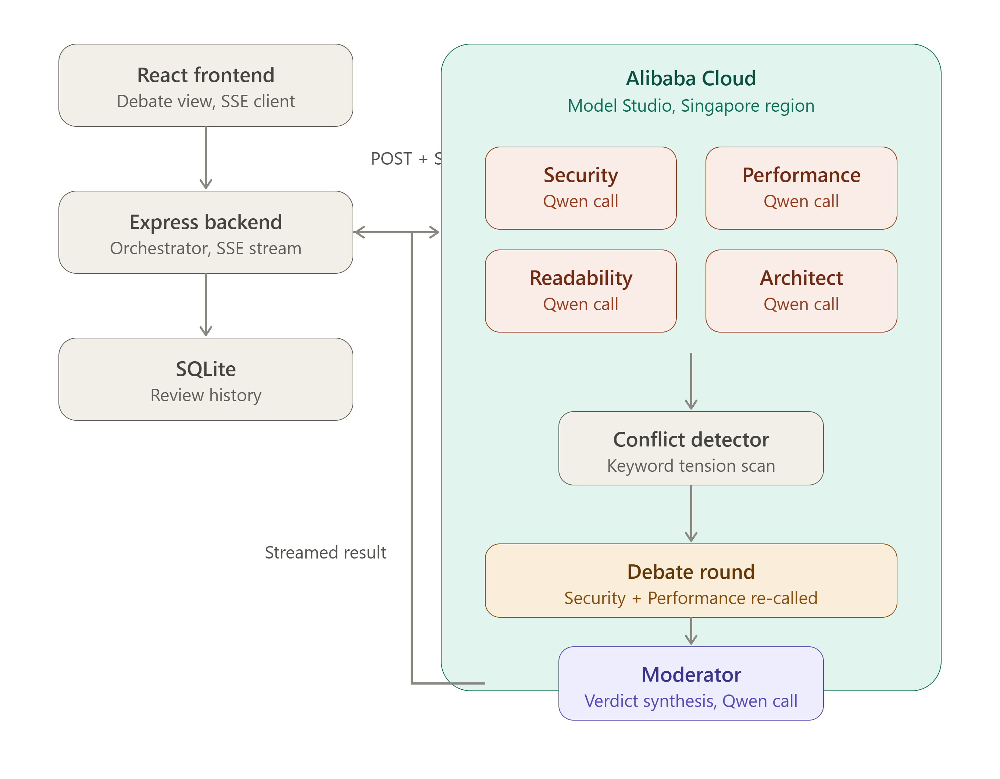

# The Council

Multi-agent code review system built for the **Global AI Hackathon with Qwen Cloud** — Track 3: Agent Society.

Four specialized AI agents — Security, Performance, Readability, and Architect — independently review submitted code, debate genuine conflicts between their recommendations, and a Moderator synthesizes a final, prioritized verdict. Built entirely on Qwen models via Alibaba Cloud Model Studio.

## Why this exists

Single-agent code review tools tend to blend every concern into one generic pass. The Council instead gives each agent a narrow, non-negotiable lens — and when two agents genuinely disagree (a security fix with a real performance cost, for example), they debate it out instead of both being silently right. A Moderator agent makes the final call with reasoning grounded in actual tradeoffs, not just severity labels.

## How it works

1. **Round 1 — parallel analysis.** All 4 agents review the code simultaneously, each restricted to their own domain (enforced both by system prompt and a programmatic keyword guard, since LLMs sometimes report obvious issues outside their lane anyway).
2. **Conflict scan.** A lightweight keyword-based detector flags candidate tensions between agents (e.g. security vs performance) to decide who needs to debate.
3. **Debate round.** Security and Performance always get a chance to push back on each other with concrete, quantified objections. Readability and Architect join only if flagged.
4. **Moderator verdict.** A fifth Qwen call synthesizes all findings and conflicts into a prioritized action list, with explicit resolutions for any real disagreements.
5. **Solo baseline.** A single generic reviewer call runs in parallel (no added latency) to measure the council's added value — shown as "+N vs solo" in the UI.

See the diagram below for the full architecture.



### Interface
 
- Split, resizable panels (code input / debate view) — collapses to a stacked layout on mobile
- Dark and light mode
- Real-time streaming debate view: each agent's findings appear as they're generated, not after a full wait

### VS Code extension

A working extension lives in [`vscode-extension/`](./vscode-extension) — select any code, run **"The Council: Review selection"** from the command palette, and the same four-agent debate runs against your local backend, with results shown in an editor-side panel. See the folder's `package.json` for setup, or press F5 inside VS Code to try it in an Extension Development Host.

## Tech stack

- **Frontend**: React + TypeScript + Vite, Tailwind CSS
- **Backend**: Node.js + Express, Server-Sent Events for real-time streaming
- **AI**: Qwen models via Alibaba Cloud Model Studio (OpenAI-compatible endpoint)

## Getting started

### Prerequisites
- Node.js 18+
- A Qwen Cloud / Model Studio API key ([Singapore region](https://bailian.console.alibabacloud.com) recommended for free quota)

### Backend

```bash
cd backend
npm install
cp .env.example .env
# Edit .env with your QWEN_API_KEY and QWEN_BASE_URL
npm run dev
```

### Frontend

```bash
cd frontend
npm install
echo "VITE_API_URL=http://localhost:3001" > .env
npm run dev
```

Open the printed local URL, paste a JavaScript, TypeScript, Python, or C snippet, and click "Run council".

## Proof of Alibaba Cloud deployment

This project's inference runs entirely on Alibaba Cloud Model Studio (Qwen Cloud). The base URL referencing Alibaba's infrastructure is visible in [`backend/.env.example`](./backend/.env.example) and used directly in [`backend/agents/orchestrator.ts`](./backend/agents/orchestrator.ts). A screen recording showing a live API call alongside the Alibaba Cloud console is included in the submission.

## Benchmark

On a representative checkout-flow snippet with a genuine security/performance tradeoff (synchronous fraud-check on a latency-sensitive path), the council found significantly more issues than a single generic reviewer call on the same code, while surfacing and resolving a real engineering disagreement between agents — see the demo video for a full run.

## License

MIT — see [LICENSE](./LICENSE).

## Track

Submitted to **Track 3: Agent Society**.
